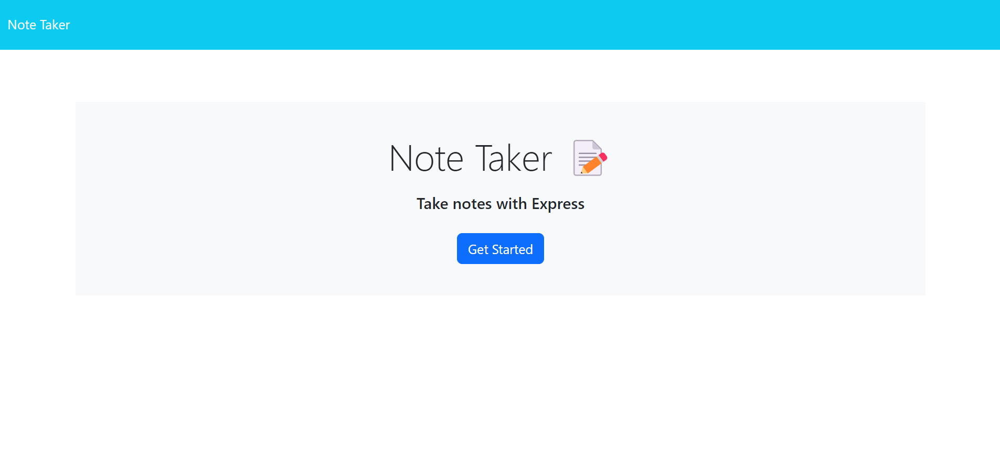
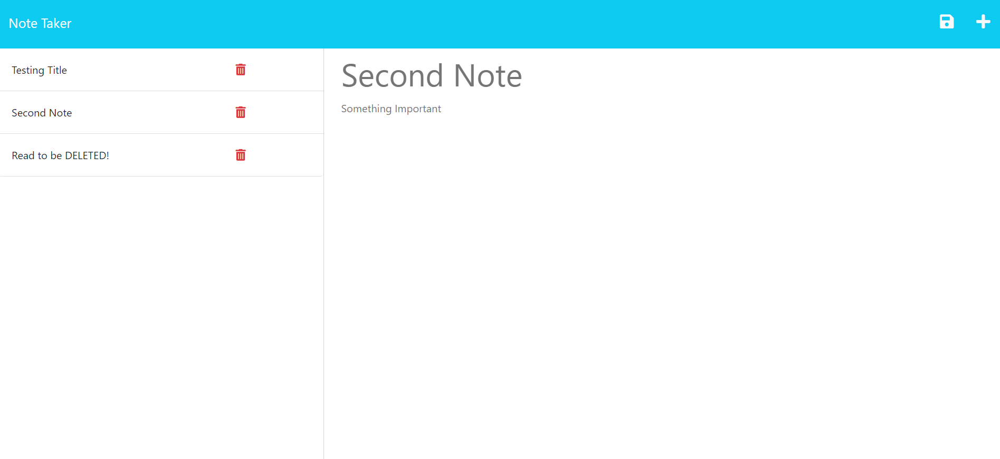
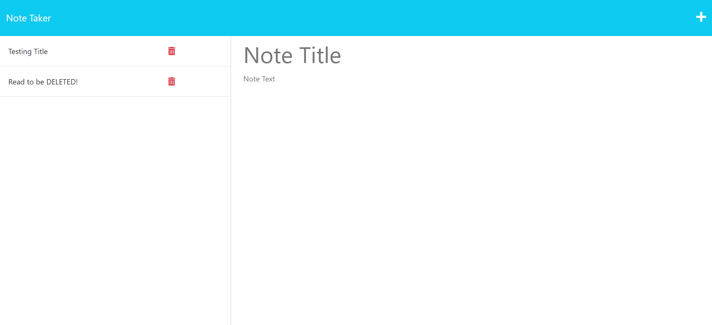

# Note-Taker

## Description

This app allows user to write notes with a title and some text content in each note. Then saving the notes into a list showing on the left hand side of the webpage with all the titles of the notes.

When user click on the saved notes, contents of the specific note that's been clicked will be displayed on the right hand side of the webpage.

A delete button is implemented to each note. Once clicked, the note will be deleted from the saved list.

This app made use of express, node.js and javascript. It has been deployed live to Heroku.

## User Story

AS A small business owner
I WANT to be able to write and save notes
SO THAT I can organize my thoughts and keep track of tasks I need to complete

## Acceptance Criteria

GIVEN a note-taking application

WHEN I open the Note Taker

THEN I am presented with a landing page with a link to a notes page

WHEN I click on the link to the notes page

THEN I am presented with a page with existing notes listed in the left-hand column, plus empty fields to enter a new note title and the note’s text in the right-hand column

WHEN I enter a new note title and the note’s text

THEN a Save icon appears in the navigation at the top of the page

WHEN I click on the Save icon

THEN the new note I have entered is saved and appears in the left-hand column with the other existing notes

WHEN I click on an existing note in the list in the left-hand column

THEN that note appears in the right-hand column

WHEN I click on the Write icon in the navigation at the top of the page

THEN I am presented with empty fields to enter a new note title and the note’s text in the right-hand column

## Mock Up

Landing Page

Saving Notes

Deleting Notes

## Installations

- Use `npm install` to install dependencies.
- Use `node server.js` to initiate the server in the terminal.
- Visit `http://localhost:3001/` in your browser. Default provided port is 3001.

## Deployments

Git Repository Link: https://github.com/Raymond-XishengChen/Note-Taker

Heroku Deployed Application: https://note-taker-raychen-615b813b3b02.herokuapp.com/
